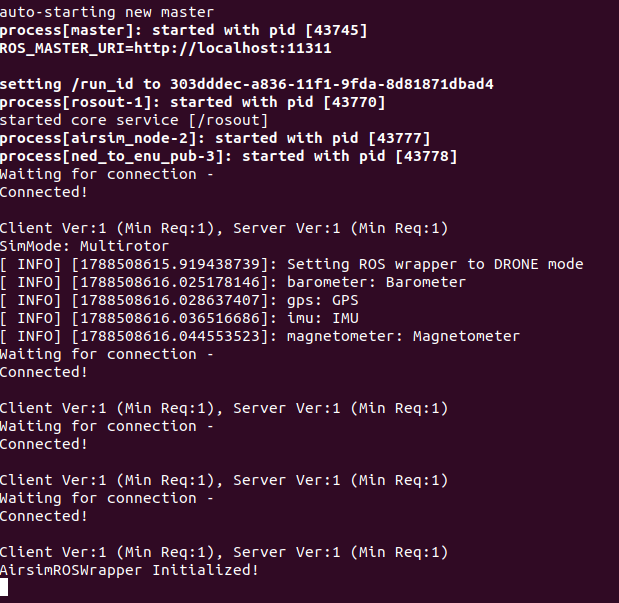
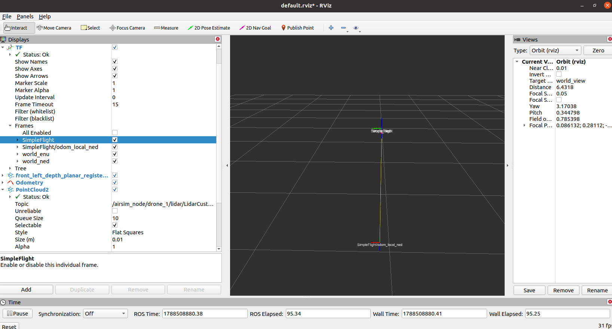
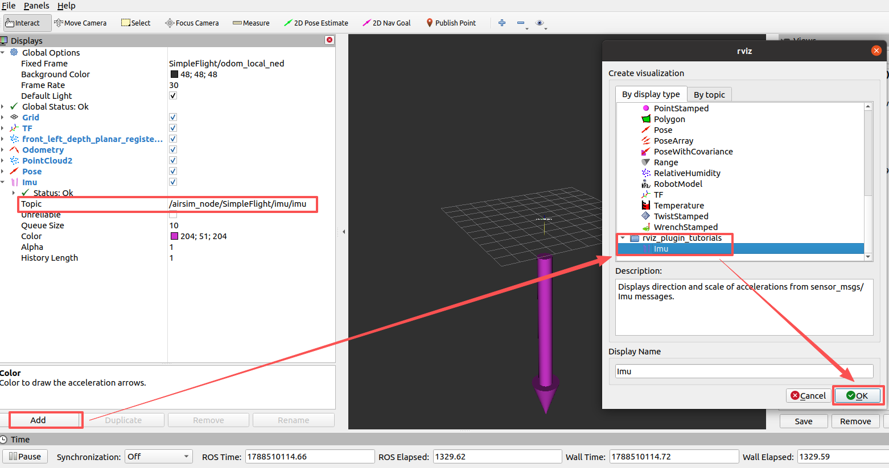

# 低空载具 ROS 封装器 airsim_ros_pkgs

该页面展示 AirSim C++ 客户端库上的 ROS 封装。

## 安装

以下步骤适用于 Linux。如果在 Windows 上运行 AirSim，则可以使用 Windows Subsystem for Linux（WSL）或者虚拟机来运行 ROS 封装，请参阅 [下面](#setting-up-the-build-environment-on-windows10-using-wsl1-or-wsl2) 的说明。如果由于某些问题，您无法或不喜欢在主机 Linux 上安装 ROS 和相关工具，您也可以使用Docker尝试，请参阅 [为 ROS 封装使用 Docker](#using-docker-for-ros) 中的步骤。


- 如果默认GCC版本不是8或更高版本（使用`GCC--version`检查） 

    - 使用 gcc >= 8.0.0: `sudo apt-get install gcc-8 g++-8`
    - 使用 `gcc-8 --version` 验证安装

- Ubuntu 16.04
    * 安装 [ROS kinetic](https://wiki.ros.org/kinetic/Installation/Ubuntu)
    * 安装tf2 sensor 和 mavros 包：`sudo apt-get install ros-kinetic-tf2-sensor-msgs ros-kinetic-tf2-geometry-msgs ros-kinetic-mavros*`

- Ubuntu 18.04
    * 安装 [ROS melodic](https://wiki.ros.org/melodic/Installation/Ubuntu)
    * 安装 tf2 sensor 和 mavros 包: `sudo apt-get install ros-melodic-tf2-sensor-msgs ros-melodic-tf2-geometry-msgs ros-melodic-mavros*`

- **Ubuntu 20.04**（推荐）
    * 安装 [ROS noetic](https://wiki.ros.org/noetic/Installation/Ubuntu)
    * 安装 tf2 sensor 和 mavros 包: `sudo apt-get install ros-noetic-tf2-sensor-msgs ros-noetic-tf2-geometry-msgs ros-noetic-mavros*`

- 安装 [catkin_tools](https://catkin-tools.readthedocs.io/en/latest/installing.html)
    `sudo apt-get install python-catkin-tools` 或
    `pip install catkin_tools`。 如果在 Ubuntu 20.04 则使用 `pip install "git+https://github.com/catkin/catkin_tools.git#egg=catkin_tools"`


## 构建

- 构建 AirSim

  ```shell
  git clone https://github.com/OpenHUTB/air.git;
  cd air;
  ./setup.sh;
  ./build.sh;
  ```

  **笔记：** 虚拟机中执行`build.sh`报错：
  ```text
  Could not find compiler set in environment variable CC:
  ...
  Make Error: CMAKE_C_COMPILER not set, after EnableLanguage
  ```
  原因：找不到编译器。切换为 gcc-9 编译成功。

  build.sh 报错：
  ```text
  /home/user/air/external/rpclib/rpclib-2.3.0/include/rpc/dispatcher.h:6:10: fatal error: 'atomic' file not found
  ```
  解决：clang-10 编译会报这个，切换成 gcc-9 并重新构建
  ```shell
  ./clean_rebuild.sh
  ```

- 确保已按照上面的安装页面中所述设置ROS的环境变量。为方便起见，将`source`命令添加到`.bashrc`中（用特定的版本名替换`mediatic`）：

  ```shell
  # Ubuntu 18.04 melodic
  # echo "source /opt/ros/melodic/setup.bash" >> ~/.bashrc
  # Ubuntu 20.04 noetic
  echo "source /opt/ros/noetic/setup.bash" >> ~/.bashrc
  source ~/.bashrc
  ```

- 构建 ROS 包

  ```shell
  cd ros;
  catkin_make
  ```

  *问题：* catkin_make报错：Unable to find either executable 'empy' or Python module 'em'...  try installing the package 'python3-empy'

  原因：系统中安装了多个Python版本，确保 CMake 和 Catkin 工作空间使用的是正确的Python

  解决：
  ```
  conda activate nn_3.8
  pip install catkin_tools
  catkin_make -DPYTHON_EXECUTABLE=/home/user/miniconda3/envs/nn_3.8/bin/python
  ```

  *问题：* Could not find a package configuration file provided by "tf2_sensor_msgs"

  解决：
  ```shell
  sudo apt-get install ros-noetic-tf2-sensor-msgs ros-noetic-tf2-geometry-msgs ros-noetic-mavros*
  ```
  如果安装ros包报错：
  ```
  Failed to fetch http://packages.ros.org/ros/ubuntu/pool/main/r/ros-noetic-mavros-msgs
  ```
  运行：
  ```shell
  curl -s https://raw.githubusercontent.com/ros/rosdistro/master/ros.asc | sudo apt-key add -
  sudo apt update
  ```

  *问题：* ModuleNotFoundError: No module named 'em'
  
  解决：
  ```shell
  # 注意必须指定版本，否则会报错：AttributeError: module 'em' has no attribute 'RAW_OPT'
  pip install empy==3.3.4
  ```

  如果默认 GCC 不是8或更高（使用`GCC--version`检查），则编译将失败。在这种情况下，请显式使用`gcc-8`，如下所示

  ```shell
  catkin build -DCMAKE_C_COMPILER=gcc-8 -DCMAKE_CXX_COMPILER=g++-8
  ```

## 运行

启动 ROS 节点
```shell
source devel/setup.bash;
# 使用 host 参数在不同机器上运行
# roslaunch airsim_ros_pkgs airsim_node.launch output:=screen host:=172.21.108.47
roslaunch airsim_ros_pkgs airsim_node.launch;
```



启动可视化工具 rviz 
```shell
# 新建一个命令行终端
source devel/setup.bash;
roslaunch airsim_ros_pkgs rviz.launch;
```




显示主题为`/airsim_node/SimpleFlight/imu/imu`的 IMU 数据（通过`rostopic list`查看所有话题）：



**注意：** 如果在运行`roslaunch airsim_ros_pkgs airsim_node.launch`时出错，请运行`catkin clean`，然后重试

如果运行 rviz 报错：
```log
(nn_3.8) user@ubuntu:~/air/ros$ roslaunch airsim_ros_pkgs rviz.launch
RLException: [rviz.launch] is neither a launch file in package [airsim_ros_pkgs] nor is [airsim_ros_pkgs] a launch file name
The traceback for the exception was written to the log file
```

解决：`source devel/setup.bash;`

## 使用 AirSim ROS 封装器

ROS 封装器由两个 ROS 节点组成：第一个是 AirSim 多旋翼 C++ 客户端库的封装器，第二个是简单的 比例-微分(PD) 位置控制器。
让我们看看这 2 个节点的ROS API：


### AirSim ROS 封装器节点

#### 发布者：

- `/airsim_node/origin_geo_point` [airsim_ros_pkgs/GPSYaw](https://github.com/microsoft/AirSim/tree/main/ros/src/airsim_ros_pkgs/msg/GPSYaw.msg)
与全球 [北东地坐标系](https://baike.baidu.com/item/NED/22375709) (NED) 坐标系对应的 GPS 坐标。此设置位于 airsim 的 [settings.json](https://microsoft.github.io/AirSim/settings/) 文件中，`OriginGeopoint` 键的值即为该坐标。

- `/airsim_node/VEHICLE_NAME/global_gps` [sensor_msgs/NavSatFix](https://docs.ros.org/api/sensor_msgs/html/msg/NavSatFix.html)
这是无人机在 Airsim 中的当前 GPS 坐标。

- `/airsim_node/VEHICLE_NAME/odom_local_ned` [nav_msgs/Odometry](https://docs.ros.org/api/nav_msgs/html/msg/Odometry.html)
相对于起飞点的 NED 坐标系里程计（默认名称：odom_local_ned，发射名称和坐标系类型可配置）。 

- `/airsim_node/VEHICLE_NAME/CAMERA_NAME/IMAGE_TYPE/camera_info` [sensor_msgs/CameraInfo](https://docs.ros.org/api/sensor_msgs/html/msg/CameraInfo.html)

- `/airsim_node/VEHICLE_NAME/CAMERA_NAME/IMAGE_TYPE` [sensor_msgs/Image](https://docs.ros.org/api/sensor_msgs/html/msg/Image.html)
  RGB 图像或浮点型图像，具体取决于 settings.json 中请求的图像类型。

- `/tf` [tf2_msgs/TFMessage](https://docs.ros.org/api/tf2_msgs/html/msg/TFMessage.html)

- `/airsim_node/VEHICLE_NAME/altimeter/SENSOR_NAME` [airsim_ros_pkgs/Altimeter](https://github.com/microsoft/AirSim/blob/main/ros/src/airsim_ros_pkgs/msg/Altimeter.msg)
这是当前高度表关于高度、气压和 [QNH](https://en.wikipedia.org/wiki/QNH) 的读数。

- `/airsim_node/VEHICLE_NAME/imu/SENSOR_NAME` [sensor_msgs::Imu](http://docs.ros.org/api/sensor_msgs/html/msg/Imu.html)
IMU 传感器数据

- `/airsim_node/VEHICLE_NAME/magnetometer/SENSOR_NAME` [sensor_msgs::MagneticField](http://docs.ros.org/api/sensor_msgs/html/msg/MagneticField.html)
  磁场矢量/罗盘测量

- `/airsim_node/VEHICLE_NAME/distance/SENSOR_NAME` [sensor_msgs::Range](http://docs.ros.org/api/sensor_msgs/html/msg/Range.html)
  测量与主动式测距仪（如红外线或 IR 测距仪）之间的距离

- `/airsim_node/VEHICLE_NAME/lidar/SENSOR_NAME` [sensor_msgs::PointCloud2](http://docs.ros.org/api/sensor_msgs/html/msg/PointCloud2.html)
  激光雷达点云

#### 订阅者:

- `/airsim_node/vel_cmd_body_frame` [airsim_ros_pkgs/VelCmd](https://github.com/microsoft/AirSim/tree/main/ros/src/airsim_ros_pkgs/msg/VelCmd.msg)
  请忽略载具名称（`vehicle_name`）字段，将其留空。该字段将在未来用于多无人机场景。 

- `/airsim_node/vel_cmd_world_frame` [airsim_ros_pkgs/VelCmd](https://github.com/microsoft/AirSim/tree/main/ros/src/airsim_ros_pkgs/msg/VelCmd.msg)
  请忽略 `vehicle_name` 字段，将其留空。该字段将在未来用于多无人机场景。

- `/gimbal_angle_euler_cmd` [airsim_ros_pkgs/GimbalAngleEulerCmd](https://github.com/microsoft/AirSim/tree/main/ros/src/airsim_ros_pkgs/msg/GimbalAngleEulerCmd.msg)
  以欧拉角表示的云台设定点。

- `/gimbal_angle_quat_cmd` [airsim_ros_pkgs/GimbalAngleQuatCmd](https://github.com/microsoft/AirSim/tree/main/ros/src/airsim_ros_pkgs/msg/GimbalAngleQuatCmd.msg)
  以四元数表示的云台设定点。

- `/airsim_node/VEHICLE_NAME/car_cmd` [airsim_ros_pkgs/CarControls](https://github.com/microsoft/AirSim/blob/main/ros/src/airsim_ros_pkgs/msg/CarControls.msg)
用于控制的油门、刹车、转向及档位选择。支持自动挡和手动挡控制模式，具体使用方法请参阅 [`car_joy.py`](https://github.com/OpenHUTB/air/blob/main/ros/src/airsim_ros_pkgs/scripts/car_joy.py) 脚本。

#### 服务:

- `/airsim_node/VEHICLE_NAME/land` [airsim_ros_pkgs/Takeoff](https://docs.ros.org/api/std_srvs/html/srv/Empty.html)

- `/airsim_node/takeoff` [airsim_ros_pkgs/Takeoff](https://docs.ros.org/api/std_srvs/html/srv/Empty.html)

- `/airsim_node/reset` [airsim_ros_pkgs/Reset](https://docs.ros.org/api/std_srvs/html/srv/Empty.html)
 重置*所有*无人机

#### 参数:

- `/airsim_node/world_frame_id` [string]
    - 设置于：`$(airsim_ros_pkgs)/launch/airsim_node.launch`
    - 默认值：world_ned 
    - 设置为 "world_enu" 可自动切换至 ENU 坐标系


- `/airsim_node/odom_frame_id` [string]
    - 设置于：`$(airsim_ros_pkgs)/launch/airsim_node.launch`
    - 默认值：odom_local_ned
    - 如果将 world_frame_id 设置为 "world_enu"，默认的 odom 名称将变为 "odom_local_enu"。

- `/airsim_node/coordinate_system_enu` [boolean]
    - 设置于`$(airsim_ros_pkgs)/launch/airsim_node.launch`
    - 默认值：false
    - 如果将 world_frame_id 设置为 "world_enu"，该设置将默认变为 true。

- `/airsim_node/update_airsim_control_every_n_sec` [double]
    - 设置于：`$(airsim_ros_pkgs)/launch/airsim_node.launch`
    - 默认值：0.01 秒。
    - 这是用于从 AirSim 更新无人机里程计（odom）与状态以及发送控制指令的定时器回调频率。目前 RPClib 与 Unreal Engine 之间的接口上限为 50 Hz。由于 ROS 中的定时器回调会以尽可能高的频率运行，因此最好不要修改此参数。

- `/airsim_node/update_airsim_img_response_every_n_sec` [double]
    - 设置于：`$(airsim_ros_pkgs)/launch/airsim_node.launch`
    - 默认值：0.01 秒。
    - 这是 AirSim 中用于从所有摄像机接收图像的定时器回调频率。实际速率取决于请求的图像数量及其分辨率。由于 ROS 中的定时器回调会以尽可能高的速率运行，因此最好不要修改此参数。 

- `/airsim_node/publish_clock` [double]
    - 设置于：`$(airsim_ros_pkgs)/launch/airsim_node.launch`
    - 默认值：false
    - 如果设置为 true，将发布 ROS 的 `/clock` 话题。


### 简单 PID 位置控制器节点

#### 参数:

- PD 控制器参数：
  * `/pd_position_node/kd_x` [double],
    `/pd_position_node/kp_y` [double],
    `/pd_position_node/kp_z` [double],
    `/pd_position_node/kp_yaw` [double]
    比例增益

  * `/pd_position_node/kd_x` [double],
    `/pd_position_node/kd_y` [double],
    `/pd_position_node/kd_z` [double],
    `/pd_position_node/kd_yaw` [double]
    微分增益

  * `/pd_position_node/reached_thresh_xyz` [double]
    从当前位置到设定点位置的欧几里得距离阈值（米）

  * `/pd_position_node/reached_yaw_degrees` [double]
    从当前位置到设定点位置的偏航距离阈值（度）

- `/pd_position_node/update_control_every_n_sec` [double]
  默认值：0.01 秒

#### 服务:

- `/airsim_node/VEHICLE_NAME/gps_goal` [请求: [srv/SetGPSPosition](https://github.com/microsoft/AirSim/blob/main/ros/src/airsim_ros_pkgs/srv/SetGPSPosition.srv)]
  目标 GPS 位置 + 偏航角（绝对高度）。

- `/airsim_node/VEHICLE_NAME/local_position_goal` [请求: [srv/SetLocalPosition](https://github.com/microsoft/AirSim/blob/main/ros/src/airsim_ros_pkgs/srv/SetLocalPosition.srv)]
  全局 NED 坐标系下的目标局部位置+偏航角。 


#### 订阅者:

- `/airsim_node/origin_geo_point` [airsim_ros_pkgs/GPSYaw](https://github.com/microsoft/AirSim/tree/main/ros/src/airsim_ros_pkgs/msg/GPSYaw.msg)
  监听由 `airsim_node` 发布的归位点（home）地理坐标。

- `/airsim_node/VEHICLE_NAME/odom_local_ned` [nav_msgs/Odometry](https://docs.ros.org/api/nav_msgs/html/msg/Odometry.html)
  监听由 `airsim_node` 发布的里程计数据

#### 发布者:

- `/vel_cmd_world_frame` [airsim_ros_pkgs/VelCmd](https://github.com/microsoft/AirSim/tree/main/ros/src/airsim_ros_pkgs/msg/VelCmd.msg)
  向 `airsim_node` 发送速度指令

#### 全局参数

- 动态约束。这些可以在 [dynamic_constraints.launch](https://github.com/OpenHUTB/air/tree/main/ros/src/airsim_ros_pkgs/launch/dynamic_constraints.launch) 中进行修改：
    * `/max_vel_horz_abs` [double]
  无人机最大水平速度（米/秒）

    * `/max_vel_vert_abs` [double]
  无人机最大垂直速度（米/秒）

    * `/max_yaw_rate_degree` [double]
  最大偏航率（度/秒）

## 杂项

### 使用 WSL1 或 WSL2 在 Windows10 上设置构架环境

这些安装说明描述了如何设置“Windows上Ubuntu上的Bash”（又名“Linux的Windows子系统”）。


它涉及在Windows10中启用内置的Windows Linux环境（WSL），安装兼容的Linux OS映像，最后安装构建环境，就像它是一个普通的Linux系统一样。


完成后，您将能够像在本机linux机器中一样构建和运行 ROS 封装器。


##### WSL1 vs WSL2

WSL2 是最新版本的 Windows 10 Linux 子系统。它比 WSL1 快很多倍（如果您使用 `/home/...` 下的原生​​文件系统，而不是 `/mnt/...` 下的 Windows 挂载文件夹），因此就速度而言，它是构建代码的首选。

安装完成后，您可以根据自己的喜好在 WSL1 或 WSL2 版本之间切换。

##### WSL 设置步骤

1. 请按照 [此处](https://docs.microsoft.com/en-us/windows/wsl/install-win10) 的说明操作。请确认您要使用的 ROS 版本与您要安装的 Ubuntu 版本兼容。 

2. 恭喜，您现在已在 Windows 下拥有一个可运行的 Ubuntu 子系统，您可以前往 [Ubuntu 16 / 18 说明](#setup) ，然后了解 [如何在 Windows 上运行 Airsim 以及在 WSL 上运行 ROS 封装程序](#how-to-run-airsim-on-windows-and-ros-wrapper-on-wsl) ！

**注意：** 您可以通过在 Windows 上安装 [VcXsrv](https://sourceforge.net/projects/vcxsrv/) 来运行 XWindows 应用程序（包括 SITL）。要使用它，请从 Windows 开始菜单找到并运行 `XLaunch`。在第一个弹出窗口中选择`多窗口(Multiple Windows)`，在第二个弹出窗口中选择`启动时不启用客户端(Start no client)`，在第三个弹出窗口中选择`仅启动剪贴板`。**不要**选择`原生 OpenGL`（如果无法连接，请选择`禁用访问控制(Disable access control)`）。您需要设置 DISPLAY 变量以指向您的显示器：在 WSL 中，它是 `127.0.0.1:0`；在 WSL2 中，它是计算机网络端口的 IP 地址，可以使用以下代码进行设置。此外，在 WSL2 中，您可能需要禁用公共网络的防火墙，或者创建一个例外，以便 VcXsrv 可以与 WSL2 通信。

    export DISPLAY=$(cat /etc/resolv.conf | grep nameserver | awk '{print $2}'):0

* 诀窍：
    - 如果你将这行添加到你的 ~/.bashrc 文件中，你就不需要再次运行这个命令了。 
    - 对于代码编辑，您可以在 WSL 中安装 VSCode。
    - Windows 10 内置了“Windows Defender”病毒扫描程序。它会显著降低 WSL 的运行速度。禁用它可以大幅提升磁盘性能，但会增加病毒感染的风险，因此请自行承担风险。以下是众多资源/视频之一，向您展示如何禁用它：[如何在 Windows 10 上禁用或启用 Windows Defender](https://youtu.be/FmjblGay3AM)

##### WSL 和 Windows 10 之间的文件系统访问

在 WSL 中，Windows 驱动器位于 /mnt 目录中。例如，要列出您的 (<用户名>) 文档文件夹中的文档：

    `ls /mnt/c/'Documents and Settings'/<username>/Documents`
    or
    `ls /mnt/c/Users/<username>/Documents`

在 Windows 系统中，WSL 发行版的文件位于（在 Windows 资源管理器地址栏中输入）：

   `\\wsl$\<distribution name>`
   例如
   `\\wsl$\Ubuntu-18.04`

##### 如何在 Windows 上运行 Airsim 以及在 WSL 上运行 ROS 封装程序

对于 WSL 1，请执行以下操作：
`export WSL_HOST_IP=127.0.0.1`
对于 WSL 2：
`export WSL_HOST_IP=$(cat /etc/resolv.conf | grep nameserver | awk '{print $2}')`
现在，就像 [在 Linux 运行部分一样](#running) ，执行以下命令： 

```shell
source devel/setup.bash
roslaunch airsim_ros_pkgs airsim_node.launch output:=screen host:=$WSL_HOST_IP
roslaunch airsim_ros_pkgs rviz.launch
```

### 使用 Docker 运行 ROS

[`tools`](https://github.com/microsoft/AirSim/tree/main/tools/Dockerfile-ROS) 目录中包含一个 Dockerfile 文件。要构建 `airsim-ros` 镜像，请执行以下操作：

```shell
cd tools
docker build -t airsim-ros -f Dockerfile-ROS .
```

要运行程序，请替换以下 AirSim 文件夹的路径：

```shell
docker run --rm -it --net=host -v <your-AirSim-folder-path>:/home/testuser/AirSim airsim-ros:latest bash
```

上述命令会将 AirSim 目录挂载到容器内的主目录中。您在主机上对源文件所做的任何更改都会在容器内生效，这对于开发和测试非常有用。现在，请按照 [构建](#build) 步骤编译并运行 ROS 封装程序。
