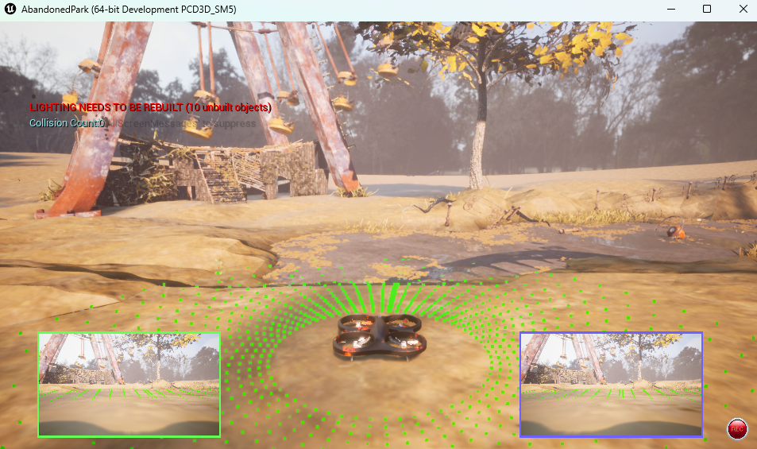
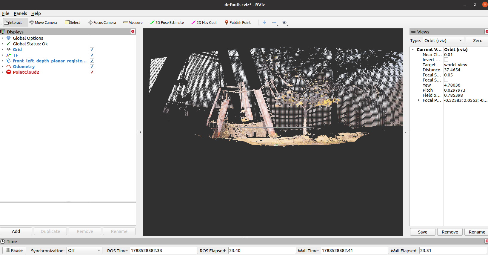
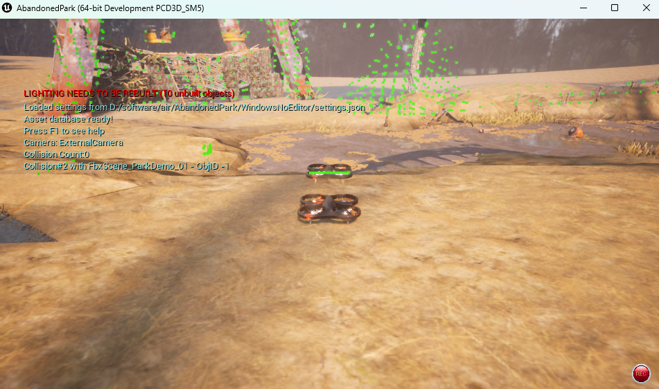
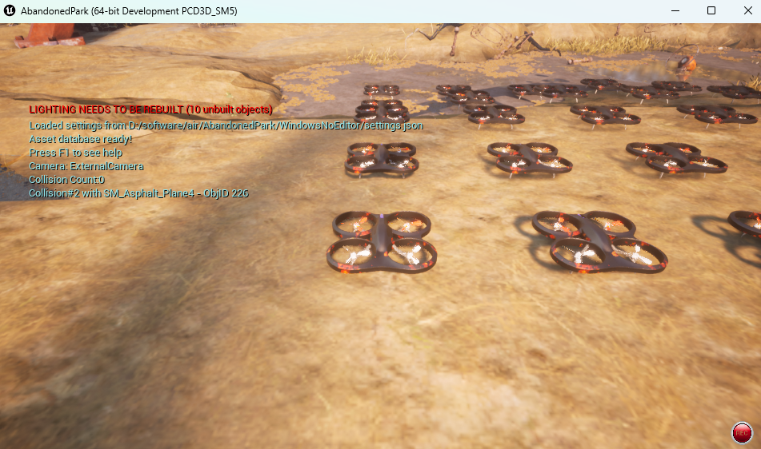

# 低空载具的 ROS 示例教程


这是一组 AirSim 的示例配置 [settings.json](https://github.com/OpenHUTB/air/tree/main/ros/src/airsim_tutorial_pkgs/settings)、roslaunch 和 rviz 文件，旨在帮助您了解如何在 ROS 中使用 AirSim。
有关 ROS API，请参阅 [低空载具 ROS 封装器 airsim_ros_pkgs](./airsim_ros_pkgs.md) 。


## 设置

确保 [airsim_ros_pkgs 设置](airsim_ros_pkgs.md) 已完成并且先决条件已安装。

```shell
$ cd PATH_TO/air/ros
$ catkin_make airsim_tutorial_pkgs
```

如果您的默认 GCC 版本不是 8 或更高版本（请使用 `gcc --version` 检查），则编译将失败。在这种情况下，请明确使用 `gcc-8`，如下所示：

```shell
catkin_make airsim_tutorial_pkgs -DCMAKE_C_COMPILER=gcc-8 -DCMAKE_CXX_COMPILER=g++-8
```

**笔记：** 为了运行示例，以及每次打开新终端时，都需要获取 `setup.bash` 文件。如果您经常使用 ROS 包装器，最好将 `source PATH_TO/air/ros/devel/setup.bash` 添加到 `~/.bashrc` 或 `~/.profile`，这样可以避免运行每次打开终端时都需要运行该命令。

## 示例

### 配备单目相机、深度相机和激光雷达的单架无人机

 - Settings.json - 一个前置立体相机和一个中心单目相机的配置 [front_stereo_and_center_mono.json](https://github.com/OpenHUTB/air/blob/main/ros/src/airsim_tutorial_pkgs/settings/front_stereo_and_center_mono.json)
 ```shell
 $ source PATH_TO/air/ros/devel/setup.bash
 $ roscd airsim_tutorial_pkgs
 # 将配置文件拷贝到用户目录下，或者 WindowsNoEditor 目录下
 $ cp settings/front_stereo_and_center_mono.json ~/Documents/AirSim/settings.json
```
 启动虚幻引擎包或二进制文件 AbandonedPark.exe（或者在其他机器启动）
 

 启动 ROS 节点：
 ```shell
 # 使用 host 参数在不同机器上运行
# roslaunch airsim_ros_pkgs airsim_node.launch output:=screen host:=172.21.108.47
 $ roslaunch airsim_ros_pkgs airsim_node.launch;

 # 在新的终端或面板
 $ source PATH_TO/air/ros/devel/setup.bash
 $ roslaunch airsim_tutorial_pkgs front_stereo_and_center_mono.launch
 ```
 上述命令将使用 tf 启动 rviz，使用 [depth_image_proc](https://wiki.ros.org/depth_image_proc) 的 [`depth_to_pointcloud` 启动文件](https://github.com/OpenHUTB/air/blob/main/ros/src/airsim_tutorial_pkgs/launch/front_stereo_and_center_mono/depth_to_pointcloud.launch) 注册 RGBD 云，以及激光雷达点云。 

 


### 2 架无人机，分别配备相机、激光雷达和 IMU

- Settings.json - 都挂载了相机、激光雷达和 IMU 的两架无人机配置 [two_drones_camera_lidar_imu.json](https://github.com/OpenHUTB/air/blob/main/ros/src/airsim_tutorial_pkgs/settings/two_drones_camera_lidar_imu.json) 

 ```shell
 $ source PATH_TO/air/ros/devel/setup.bash
 $ roscd airsim_tutorial_pkgs
 # 将配置文件拷贝到用户目录下，或者 WindowsNoEditor 目录下
 $ cp settings/two_drones_camera_lidar_imu.json ~/Documents/AirSim/settings.json
 ```
 启动虚幻包或二进制文件
 

 启动 ROS 节点
 ```shell
 roslaunch airsim_ros_pkgs airsim_node.launch;
 # roslaunch airsim_ros_pkgs rviz.launch output:=screen host:=172.21.108.47
 roslaunch airsim_ros_pkgs rviz.launch
 ```
您可以在 rviz 中查看 tfs。然后运行 `rostopic list` 和 `rosservice list` 来检查可用的服务。   


### 25 架无人机组成一个方形图案

- Settings.json - 配置文件 [twenty_five_drones.json](https://github.com/OpenHUTB/air/blob/main/ros/src/airsim_tutorial_pkgs/settings/twenty_five_drones.json) 

 ```shell
 $ source PATH_TO/air/ros/devel/setup.bash
 $ roscd airsim_tutorial_pkgs
 # 将配置文件拷贝到用户目录下，或者 WindowsNoEditor 目录下
 $ cp settings/twenty_five_drones.json ~/Documents/AirSim/settings.json
 ```
 从这里启动你的虚幻引擎包或二进制文件
 
 ```shell
 $ roslaunch airsim_ros_pkgs airsim_node.launch;
 $ roslaunch airsim_ros_pkgs rviz.launch
 ```
您可以在 rviz 中查看 tfs。
然后运行 `rostopic list` 和 `rosservice list` 来检查可用的服务。
 
