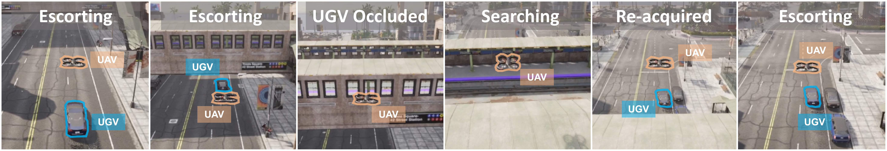

# 闭环空地协同VLA评估套件

## 摘要

近期的空中视觉-语言-动作（VLA）模型在单架无人机（UAV）任务中展现出了良好的能力，例如追踪移动物体以及导航至语言指定的标志性地点。然而，尚不清楚这些能力能否迁移到空地协同场景中——在该场景下，无人机与无人地面车辆（UGV）必须在一个共享的闭环物理世界中协同行动。我们利用 CARLA-AIR 这一单进程空地协同评估环境对此进行了研究；该环境将 CARLA 和 AirSim 统一整合在同一个虚幻引擎（Unreal Engine）运行时中。通过共享世界状态、物理仿真步长（physics tick）和感知流水线，CARLA-AIR 实现了物理一致的无人机-UGV 交互，并支持对仿真时间戳对齐及有效协同延迟的精确测量。我们利用 CARLA-AIR 评估了具有代表性的空中 VLA 及规划基线模型，测试任务包括两个互补的诊断场景：移动平台着陆和遮挡恢复护航。结果表明，尽管当前的空中 VLA 模型通常能够追踪或跟随地面伙伴，却难以将这种单智能体能力转化为稳定的协同行为。“状态提示”（state prompting）带来的收益有限，而简单的双向交互往往无法持续提升性能，甚至可能放大大多数基线模型的误差。这些发现表明，在现有的基于文本提示的交互界面下，实现零样本（zero-shot）空地协同 VLA 需要在当前范式之外引入三个关键要素：明确的伙伴状态映射（partner-state grounding）、低延迟的动作协同以及团队层面的目标对齐。

## 介绍

在城市搜救、自主物流、巡检及智能交通等领域，空地协同正成为具身智能的一项重要能力 [@chai2024cooperative]。无人机（UAV）能够提供广域的空中感知，而无人地面车辆（UGV）则能执行地面作业并承载更重的载荷 [@zeng2026ezreal]。从原理上讲，这两种平台具有高度的互补性；然而在实际应用中，要将这种互补性转化为真正的协同，则要求智能体在物理世界的闭环中实现状态共享、行动协调以及相互响应 [@chen2026vision]。

近期的空中视觉-语言-动作（Vision-Language-Action, VLA）模型提供了一个极具吸引力的起点。它们能够根据语言指令行事，追踪地面移动目标，并利用机载观测信息向视觉目标导航 [@zhang2026uav;@gao2026openfly;@sautenkov2025uav;@liu2023aerialvln]。这些能力构成了空地协同中有用功能的重要组成部分。

这就引出了一个核心问题：单架无人机（UAV）的视觉定位与建图（VLA）能力能否自然地迁移到无人机与无人地面车辆（UGV）的协同行为中？

我们认为，这一问题在很大程度上仍未得到解答。现有的空地数据集 [@ye2024uav3d] 主要侧重于评估离线感知能力，而现有的交互式仿真器 [@wang2025transimhub;cui2026airsimag] 往往依赖于基于桥接（bridge-based）或多进程的架构，且各组件拥有独立的时钟。这种设定使得难以准确衡量：某个智能体的信号是否真正改善了协作伙伴的实时行为，抑或观察到的性能提升或失效，部分源于评估平台自身引入的时钟不匹配与通信延迟。要对协作式视觉-语言-动作（VLA）模型进行可靠评估，必须具备共享的物理世界、闭环交互机制以及可度量的端到端协作延迟。

为此，我们引入了 CARLA-AIR [@zeng2026carla]——这是一个单进程的空地协同评估环境，在同一个 Unreal Engine 运行时中整合了 CARLA 和 AirSim。CARLA-AIR 保留了 CARLA 的城市交通仿真能力和 AirSim 的多旋翼动力学特性，同时将无人机（UAV）和无人地面车辆（UGV）置于统一的世界状态、物理步长（physics tick）和感知流水线之下。这种设计实现了物理一致的交互，并消除了因将 UAV 和 UGV 仿真器作为独立进程进行桥接而可能产生的仿真时间戳不匹配问题。

基于 CARLA-AIR 平台，我们评估了现有的空中 VLA（视觉-语言-动作）模型能否突破单一智能体行为的局限，实现空地协同。为此，我们设计了两项互补的诊断任务：“协同移动平台着陆”任务旨在测试针对地面伙伴的视觉追踪能否转化为协同动作；“协同遮挡恢复护航”任务则旨在测试伙伴状态线索是否有助于在发生短暂遮挡后恢复视觉接触。这两项任务分别从动作和感知两个维度考察协同能力，同时保持空中 VLA 模型的原生接口不变。

我们的研究结果揭示了空中能力与协作之间存在持续的差距。现有的空中视觉语言智能体（VLA）模型往往能够追踪或跟随无人地面车辆（UGV），但这种能力并不能可靠地转化为成功的协作行为。基于伙伴状态的提示（partner-state prompting）带来的收益有限且不稳定，而简单的双向交互甚至可能放大误差。相比之下，在具备明确的度量状态信息和低延迟协调能力的情况下，基于状态的协作参考方案表现出显著优势。这些发现表明，单架无人机（UAV）的 VLA 能力并不等同于协作；空地协作 VLA 需要具备伙伴状态建模、协作观测设计、伙伴感知动作落地（action grounding）以及团队级目标对齐等机制。

**贡献：**

1. **闭环评估运行时环境**。我们推出了 CARLA-AIR 并对其进行了验证；这是一个单进程的空地评估运行时环境，旨在统一 CARLA 和 AirSim，以支持无人机（UAV）与无人车（UGV）之间的闭环交互。通过共享世界状态、物理仿真步长（physics ticks）和感知流水线，CARLA-AIR 从机制上确保了物理一致的交互，且不存在仿真时间戳不匹配的问题。这为空地协同的闭环评估提供了可靠的基础，避免了仿真器同步误差对评估结果造成干扰。

2. **诊断评估套件**。我们引入了两项互补的诊断任务——移动平台着陆与遮挡恢复护航，并配套了通信协议、基准方法、基于状态的协作参考标准，以及能够区分单无人机能力与协作成功与否的评估指标。这些组件共同构成了一套针对性诊断套件，旨在隔离协作失效模式，而非对通用自主系统进行排名。

3. **科学发现**：在零样本评估及基于文本提示的测试方案下，现有的空中 VLA（视觉-语言-动作）模型无法自然地将单一无人机的能力迁移至空地协同场景——即追踪行为未必能转化为协同配合，来自伙伴的提示也未必能稳定触发恢复动作；对于大多数基线模型而言，这种简单的交互方式甚至可能放大错误。

## 诊断性评估

基于物理一致且支持闭环评估的运行环境，我们利用 CARLA-AIR 来回答本文的核心问题：现有的空中 VLA 模型能否将其在单架无人机上习得的能力迁移至空地协同行为中？

我们设计了两个互补的诊断任务。任务一“协同移动平台着陆”旨在诊断动作层面的协同能力：无人机需追踪移动中的无人地面车辆（UGV），对准其后部货箱，并安全着陆。任务二“协同遮挡恢复护航”旨在诊断感知层面的恢复能力：无人机需利用伙伴状态线索，重新建立与暂时被遮挡的UGV的视觉联系。这两项任务均保持了原生的空中视觉-语言-动作（VLA）接口不变：策略接收视觉观测和语言指令，并仅输出无人机的动作指令。

### 任务与协作协议

在“移动平台着陆”任务中，一辆无人地面车辆（UGV）沿城市道路行驶，其平坦的后部货厢作为着陆表面。该任务要求无人机（UAV）将可见光追踪过程转化为对移动平台的精准对齐、下降及着陆。在“遮挡恢复与伴随”任务中，UGV 会因桥梁、建筑物或大型物体而暂时被遮挡；无人机必须利用关于伴随对象状态的线索，在遮挡结束后重新建立视觉联系。

我们评估了三种协作模式。模式 C0 采用独立执行且无通信的方式。模式 C1 在 UGV 执行预定义行为的同时，引入了一种紧凑的“UGV-至-UAV 伙伴状态”提示信息。模式 C2 仅用于着陆任务，它额外将 UAV 前向速度动作信号的幅值传递给 UGV 的纵向控制器，从而实现了一种简单的 UAV 与 UGV 间的双向动作耦合。该信号源自各基准方法的原生动作接口（见附录 B）。“护航”（Escort）任务仅使用 C0 和 C1 模式。完整的提示词模板及控制器详细信息请参阅附录 B。

### 基线与指标

表3总结了所评估的方法，涵盖了端到端VLA、基于VLM的规划以及传统的空中VLN。各项基线方法均通过其原生的底层封装（见附录B）进行运行；所报告的数值反映了各类策略的特性，而非基于具体实现优劣的排名。

Rule-Coop-State 被纳入作为可解性参考，而非公平的基准。它利用了 VLA 基准无法获取的显式度量状态信息——包括无人机与载货平台间的相对位姿及相对速度、地面车辆（UGV）速度以及着陆阶段——并采用确定性的低延迟规则进行控制。因此，Rule-Coop-State 与 VLA 方法之间的性能差异，既反映了架构上的不同，也体现了信息获取能力的差异。我们在这一框架下解读后续的所有结果。

## 参考
