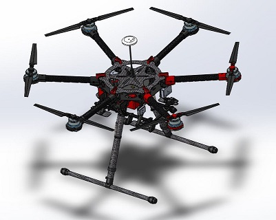
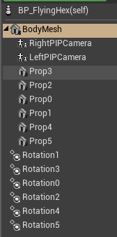
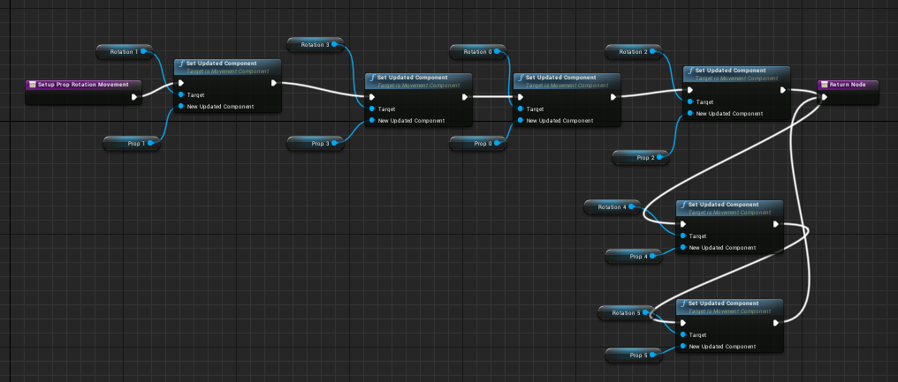

## 构造六旋翼飞行器
那么 AirSim 能飞六旋翼飞行器吗？答案是可以，但设置起来需要一些工作。具体来说，需要更新三个组件：首先是 PX4 固件，然后是 AirSim 物理系统，最后是渲染模型。

### PX4 修改

PX4 需要处于`六轴飞行器模式(hexacopter mode)`，才能为所有 6 个电机提供输出。但是，如果您熟悉 QGroundControl 的“HIL 四轴飞行器”机身，您会注意到它没有 HIL 六轴飞行器。根据 PX4 团队的说法，我们不需要使用特殊的机身就能让 PX4 在 HIL 模式下正常工作，但很遗憾，今天我们不得不这么做。PX4 存在一些 bug，会导致 HIL 模式在任何机身上都无法正常工作。因此，除了修复这些 bug 之外，以下是获取 HIL 六轴飞行器机身选项的快速方法。首先，按照 [px4](https://github.com/Microsoft/AirSim/wiki/px4.md%5D) 中的说明克隆 git 仓库，然后执行以下操作：

```shell
cd ROMFS/px4fmu_common/init.d
cp 1001_rc_quad_x.hil 1004_rc_hex_x.hil
gedit 1004_rc_hex_x.hil
```

并使其包含以下内容：
```shell
#!nsh
#
# @name HIL Quadcopter +
#
# @type Simulation
#
# @maintainer Anton Babushkin <anton@px4.io>
#

sh /etc/init.d/rc.mc_defaults

set MIXER hexa_x

# Need to set all 8 channels
set PWM_OUT 12345678

set HIL yes
```

保存此文件，然后使用 `make px4fmu-v2_default` 命令重新构建 px4。如果您已经构建过，请删除之前的构建输出 `build_px4fmu-v2_default`，以确保您的新构建选择这个新的ROMFS文件。

现在找到名为 `PX4AirframeFactMetaData.xml` 的 QGroundControl 配置文件，在 Windows 上，它位于 `%APPDATA%\QGroundControl.org\PX4AirframeFactMetaData.xml`。找到 airframe id="1001"，复制整个 airframe XML 元素并将其替换为：

```xml
    <airframe id="1004" maintainer="Anton Babushkin &lt;anton@px4.io&gt;" name="HIL Hexacopter X">
      <maintainer>Anton Babushkin &lt;anton@px4.io&gt;</maintainer>
      <type>Simulation</type>
    </airframe>
```

您可以将维护者设置为任意人。现在，当您的 Pixhawk 重启时，QGroundControl 应该会在“HIL”机身类型下显示一个 `HIL Hexacopter X` 选项，选择它并将其应用到 PX4 上，重启后，它就可以在 HIL 模式下作为六轴飞行器飞行了。


### AirSim 物理系统

物理很简单，您需要做的就是在 [设置 json 文件](https://github.com/Microsoft/AirSim/wiki/settings.md) 中指定这个“模型”：
```shell
"Model": "Hexacopter",
```

但这有什么作用呢？在内部，这会导致 Px4MultiRotor.hpp 调用 setupFrameGenericHex()，后者调用 initializeRotorHexX，该方法根据 [推荐的电机布置](http://ardupilot.org/copter/docs/connect-escs-and-motors.html) 执行以下操作。

```cpp
static void initializeRotorHexX(vector<RotorPose>& rotor_poses /* the result we are building */,
    uint rotor_count /* must be 6 */,
    real_T arm_lengths[],
    real_T rotor_z /* z relative to center of gravity */)
{
    Vector3r unit_z(0, 0, -1);  //NED frame
    if (rotor_count == 6) {
        rotor_poses.clear();
        /* Note: rotor_poses are built in this order: rotor 0 is CW

            x-axis
          (2)    (4)
            \  /
             \/
        (1)-------(0) y-axis
             /\
            /  \
          (5)  (3)

        */

        // vectors below are rotated according to NED left hand rule (so the vectors are rotated counter clockwise).
        Quaternionr quadx_rot(AngleAxisr(M_PIf / 6, unit_z));
        Quaternionr no_rot(AngleAxisr(0, unit_z));
        rotor_poses.emplace_back(Vector3r(0, arm_lengths[0], rotor_z),
            unit_z, RotorTurningDirection::RotorTurningDirectionCW);
        rotor_poses.emplace_back(Vector3r(0, -arm_lengths[1], rotor_z),
            unit_z, RotorTurningDirection::RotorTurningDirectionCCW);
        rotor_poses.emplace_back(VectorMath::rotateVector(Vector3r(arm_lengths[2], 0, rotor_z), quadx_rot, true),
            unit_z, RotorTurningDirection::RotorTurningDirectionCW);
        rotor_poses.emplace_back(VectorMath::rotateVector(Vector3r(-arm_lengths[3], 0, rotor_z), quadx_rot, true),
            unit_z, RotorTurningDirection::RotorTurningDirectionCCW);
        rotor_poses.emplace_back(VectorMath::rotateVector(Vector3r(0, arm_lengths[4], rotor_z), quadx_rot, true),
            unit_z, RotorTurningDirection::RotorTurningDirectionCCW);
        rotor_poses.emplace_back(VectorMath::rotateVector(Vector3r(0, -arm_lengths[5], rotor_z), quadx_rot, true),
            unit_z, RotorTurningDirection::RotorTurningDirectionCW);
    }
    else
        throw std::invalid_argument("Rotor count other than 6 is not supported by this method!");
}
```

现在可能需要解释一下上面的 Vector3r 参数。上面标记为 (0) 的第一个电机位于 y 轴上，因此它的矢量很明显：`Vector3r(0, arm_lengths[0], rotate_z)`，x 轴为 0，y 轴为臂长。
标记为 (1) 的第二个电机也很明显。但是电机 (2) 呢？`VectorMath::rotateVector(Vector3r(arm_lengths[2], 0, rotate_z), quadx_rot, true)` 的 x 轴设置为臂长，y 轴设置为零，这意味着它在上图中一开始是垂直向上的。然后我们应用 pi/6 的旋转。但是旋转使用的是 NED 坐标系中的左手旋转规则，其中 z 轴向下，所以伸出左手，拇指向下，弯曲其他四指，这就是旋转的方向，即逆时针。因此，指向上方的臂会旋转到电机 (2) 所示的位置。其他机械臂也一样，现在我们的物理设置已经正确，可以用于六轴飞行器了。当然，你也可以根据需要增加质量，并调整电机推力参数。


### 渲染

最后，为了进行渲染，我们需要一个漂亮的六旋翼飞行器三维模型。Udeshaya Wadhwa 制作了 [一个可爱的 DJI S900 模型](https://grabcad.com/library/dji-s900-hex-rotor-drone-1) 。



所以我拿了这个模型，把电机拆了下来（这样我们就可以旋转它们了），这些可以 [在这里找到](https://github.com/Microsoft/AirSim/wiki/images/DJI%20S900.zip) 。你可以 [把这些网格导入虚幻引擎](https://docs.unrealengine.com/latest/INT/Engine/Content/Types/StaticMeshes/HowTo/Importing/index.html) 。我发现，对于模块化社区世界，我必须将 x 轴旋转 90 度，并将模型缩小到原始尺寸的 20% 左右，将默认材质改为漂亮的金属灰色，并根据四轴飞行器蓝图添加单独的可旋转电机。


我所做的是复制并粘贴 BP_FlyingPawn，将其命名为 BP_FlyingHex，然后添加另外 2 个道具和另外 2 个旋转，如下所示：



然后我编辑了 SetupPropProtationMovement 图，以便它连接 2 个新的道具：



需要注意的是，您无法通过复制/粘贴来获取“Rotation 4”节点，您必须从“组件”列表中拖出“Rotation 4”，然后选择“获取”，然后将其连接到新的“设置更新组件”框，对于“Prop 4”和“Prop 5”也同样操作。

<!--
mp4 转 gif: https://convertio.co/zh/mp4-gif/
-->
现在您只需让它飞起来即可！是的，它成功了 :-) 


