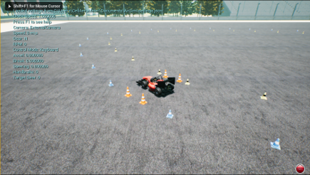

# 方程式学生以色列理工学院无人驾驶赛车 - 基于 AirSim

要查看 AirSim git 和原始 README，请转到 [AirSim git](https://github.com/Microsoft/AirSim)。

该项目旨在为方程式学生无人驾驶赛车比赛训练和实现自动驾驶算法。在此类比赛中，一辆由学生设计和制造的方程式赛车需要穿越之前从未见过的、由交通锥标记的赛道。
我们提供了一个用于方程式学生赛车和无人驾驶赛车比赛环境的模拟器。该模拟器基于 AirSim。

  
*以色列理工学院学生方程式赛车。左为实车，右为模拟车。*  

AirSim 是一款基于虚幻引擎构建的无人机、汽车等模拟器。它开源且跨平台，支持与 PX4 等主流飞行控制器进行硬件在环，以实现物理和视觉上逼真的模拟。它以虚幻插件的形式开发，可以轻松集成到任何您想要的虚幻环境中。

我们的目标是为人工智能研究提供一个平台，为方程式学生无人驾驶汽车试验深度学习，特别是模仿学习。

方程式学生以色列理工学院赛车模型由 [Ryan Pourati](https://www.linkedin.com/in/ryanpo) 提供。

环境场景由 [PolyPixel](https://www.polypixel3d.com/) 提供。

  
*仅基于 AirSim 数据，使用经过训练的模仿学习模型在现实世界中驾驶*  

## 先决条件

* 操作系统：Windows 10
* GPU: Nvidia GTX 1080 或更高版本（推荐）
* 软件: Unreal Engine 4.18 和 Visual Studio 2017 (see [upgrade instructions](https://github.com/Microsoft/AirSim/blob/master/docs/unreal_upgrade.md))
* 注意：此存储库是从 AirSim 1.2 分支出来的

## 如何获取

### Windows
* [构建](./build_FSTDriverless_windows.md)

## 如何使用

### 选择模式：汽车、多旋翼或计算机视觉

默认情况下，AirSim 会提示您选择“Car”或“Multirotor”模式。您可以使用 [SimMode 设置](https://github.com/Microsoft/AirSim/blob/master/docs/settings.md#simmode) 将默认车辆指定为“Car”（Formula Technion Student 赛车）。

### 手动驾驶

如果您有如下所示的方向盘（罗技 G920），您可以在模拟器中手动控制车辆。您也可以使用箭头键手动驾驶。

[更多细节](../../steering_wheel_installation.md)

### 利用模仿学习来驾驶汽车

我们利用模仿学习训练了一个深度学习模型，使其能够仅通过一个摄像头作为输入来驾驶一辆方程式赛车。我们的训练代码文件可在 [此处](https://github.com/FSTDriverless/AirSim/tree/master/PythonClient/imitation_learning) 获取，这些代码文件基于 [AirSim cookbook](https://github.com/Microsoft/AutonomousDrivingCookbook)。

### 收集训练数据

我们添加了一些[图形功能](./graphic_features.md)，以简化数据记录过程。
您可以使用[此](./cameras_positioning.md)教程更改摄像机的位置。

您可以通过两种方式从 AirSim 生成用于深度学习的训练数据。最简单的方法是直接点击右下角的“记录”按钮。这将开始记录每一帧的姿势和图像。数据记录代码非常简单，您可以根据自己的喜好进行修改。

按照您所需的方式生成训练数据的更好方法是访问 API。这使您可以完全控制记录数据的方式、内容、位置和时间。

### 实车实现

您可以在此 [存储库](https://github.com/FSTDriverless/FSTImplementation) 中找到我们在 Nvidia Jetson TX2 上对该算法的实现。
 

### 方程式大学生以色列理工学院算法团队

[Tom Hirshberg](https://www.linkedin.com/in/tom-hirshberg-93935b16b/), [Dean Zadok](https://www.linkedin.com/in/dean-zadok-36886791/) 和 [Amir Biran](https://www.linkedin.com/in/amir-biran-199891125/).  

### 致谢  

我们要感谢我们的导师：Kira Radinsky 博士、Ashish Kapoor 博士和 Boaz Sternfeld。
感谢以色列理工学院智能系统实验室 (ISL) 的支持。